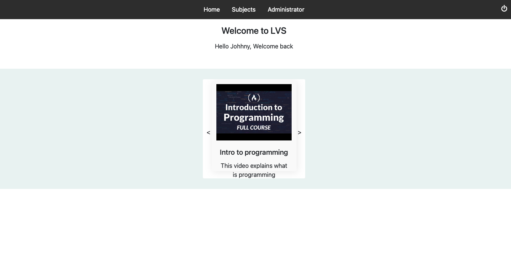

# What is LVS
LVS is a simple fictional student management system 
It offers the posiblity for students and teachers to interact with eachother
it has a simple login system on which three types of users can log into

# Technology
This app was made using HTML, CSS, and Vanilla JS
The backend is implemented using Node JS with Express.
The database was implemented with MongoDB

# Disclaimer
This is not a complete application and should not be judged as one.
This was made as a year project and can serve as reference for other students looking for examples.
I encourage you to improve on it

# Steps to start app
### 1 Install dependencies
npm install

### 2 Configure .env
set MongoDB database uri (Local or Cloud)
set random accessToken and refreshToken secret

### 3 Start server
npm start

### 4 Create a new administrator user(Make sure to have "Rest client" VS code extension)
Go intro requests.rest and click on send request under ADD Admin header
You can also run a script using axios to add an admin

### 5 Login and checkout the app
START SERVER with npm start

## Link to working demo
https://studentmanagementsystm.herokuapp.com/#
Database access is restricted on demo
